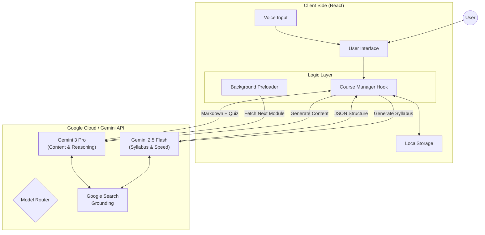
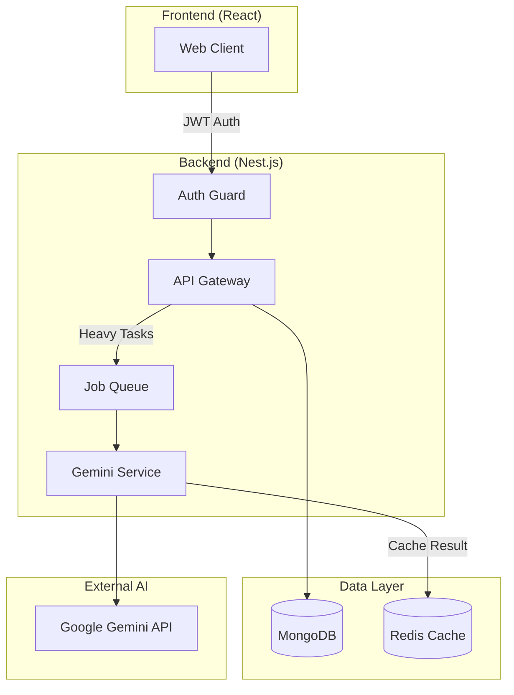

# Bangla EduAgent 🎓
🔥 **⚠️ IMPORTANT: Requires Paid Google Gemini Pro API Key** ⚠️
Bangla EduAgent uses advanced Gemini 3 Pro / 2.5 Flash models with Google Search grounding.

Get your paid key: [Google AI Studio](https://aistudio.google.com/app/apikey)

**AI-Powered Personalized Learning Path Generator in Bengali**

Bangla EduAgent is a sophisticated educational web application designed to bridge the language gap in technical and general education. By leveraging Google's Gemini 3 Pro and Gemini 2.5 Flash models, it dynamically generates personalized courses, quizzes, and learning materials in the Bengali language based on user-defined topics.

## 🚀 Project Purpose

The primary goal of this project is to democratize access to high-quality education for Bengali speakers. Traditional MOOCs (Massive Open Online Courses) are predominantly in English, creating a barrier for millions of learners. Bangla EduAgent acts as an intelligent tutor that:
1.  **Translates & Adapts:** Instantly creates content on complex topics (e.g., "Quantum Physics", "React JS") in Bengali.
2.  **Personalizes:** Generates a syllabus tailored to the topic.
3.  **Validates:** Uses Google Search Grounding to ensure facts are up-to-date and provides citations.

## 🛑 The Challenge

While information is abundant, accessibility is not distributed equally:
*   **Language Barrier:** Tech documentation and advanced tutorials are almost exclusively in English.
*   **Static Content:** Traditional courses become outdated quickly.
*   **Lack of Context:** Direct translation tools (like Google Translate) often fail to capture the *educational context* or technical nuance required for learning.

**Bangla EduAgent solves this by generating fresh, context-aware, grounded educational content on demand.**

## 🛠️ Prerequisites & Required Tools

Before running the project, ensure you have the following installed:

*   **Node.js** (v18.0.0 or higher)
*   **npm** (Node Package Manager) or **yarn**
*   **Google AI Studio API Key** (Required for Gemini models)

## ⚙️ Setup Instructions

Follow these steps to run the project locally:

1.  **Clone the Repository**
    ```bash
    git clone https://github.com/your-username/bangla-eduagent.git
    cd bangla-eduagent
    ```

2.  **Install Dependencies**
    ```bash
    npm install
    ```

3.  **Configure Environment Variables**
    Create a file named `.env.local` in the root directory.
    ```bash
    touch .env.local
    ```

4.  **Add API Key**
    Open `.env.local` and add your Google Gemini API key:
    ```env
    API_KEY=your_actual_api_key_here
    ```
    *Note: You must use a paid tier project or a valid AI Studio key to access Gemini 3 Pro and Search Grounding.*

5.  **Start the Application**
    ```bash
    npm start
    ```
    The app should now be running at `http://localhost:3000` (or the port specified by your bundler).

## 💡 Solution Overview

The application follows a **client-side AI architecture**. It communicates directly with Google's GenAI API from the browser to minimize latency for this prototype phase.

*   **Syllabus Agent (Gemini 2.5 Flash):** Responsible for high-speed planning. It breaks down a topic into a structured JSON syllabus.
*   **Content Agent (Gemini 3 Pro):** Responsible for deep reasoning and content generation. It writes the markdown content for each module and generates relevant quizzes.
*   **State Management:** Uses React Hooks (`useCourseManager`) and LocalStorage to persist user progress and courses offline.

## ✨ Key Features

*   **Generative Course Creation:** Type any topic, and get a full course structure in seconds.
*   **Voice Input:** Integrated Web Speech API allows users to search topics via voice commands.
*   **Search Grounding:** Content is backed by real-time Google Search results with source links.
*   **Interactive Quizzes:** AI-generated multiple-choice questions with detailed explanations.
*   **Smart Preloading:** Background fetching of the "next module" ensures zero wait time between lessons.
*   **Progress Tracking:** Dashboard with visual charts and "Certified" badges upon completion.
*   **Bengali Typography:** Optimized fonts (`Noto Sans Bengali`) for readability.

## 🏗️ Architecture Diagrams

### 1. Current Architecture (Client-Side MVP)
This version is optimized for hackathons and quick deployment, leveraging React and direct Gemini API calls.



### 2. Future Architecture (Scalable Full-Stack)
This is the target architecture designed to support 10,000+ concurrent users, authentication, and heavy processing.



## 🌍 Project Impact

*   **Accessibility:** Removes language barriers for technical skill acquisition.
*   **Engagement:** Gamified elements (quizzes, confetti, progress bars) keep learners motivated.
*   **Scalability:** The AI-driven model means the platform can teach *any* subject without needing human authors to write the content manually.

## 🚀 Future Plans & Roadmap

We are transitioning from a client-side prototype to a robust full-stack application.

1.  **Backend Migration:** Move logic to **Nest.js**.
2.  **Database:** Implement **MongoDB** for user accounts and cloud persistence.
3.  **Authentication:** Add Login/Signup functionality.
4.  **Admin Portal:** Tools for monitoring usage and managing users.
5.  **Social Sharing:** Share course certificates on social media.
