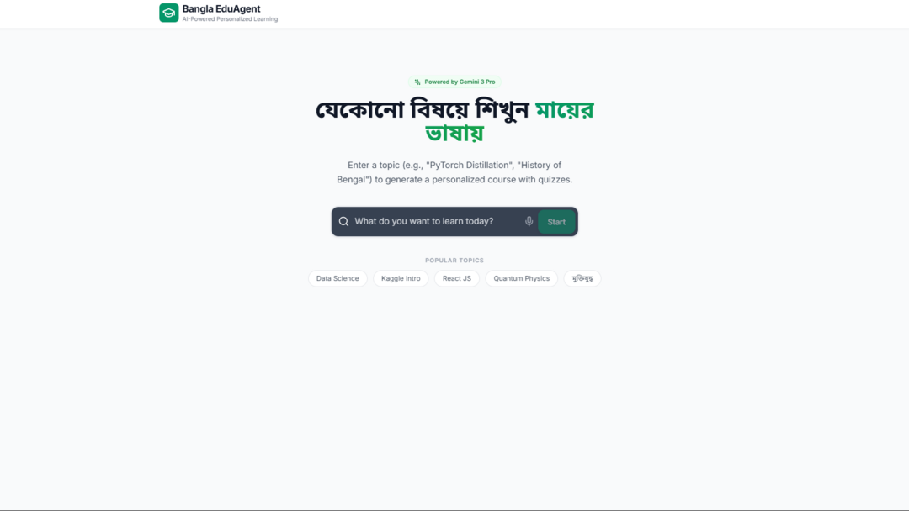
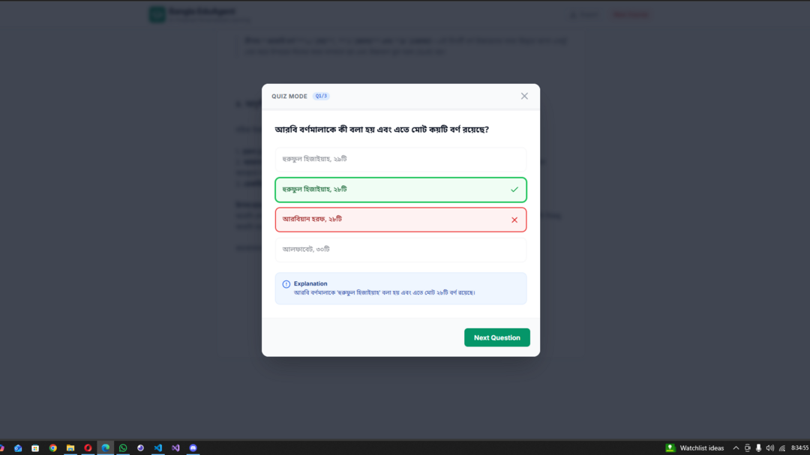

# Bangla EduAgent
🔥 **⚠️ IMPORTANT: Requires Paid Google Gemini Pro API Key** ⚠️
Bangla EduAgent uses advanced Gemini 3 Pro / 2.5 Flash models with Google Search grounding.

Get your paid key: [Google AI Studio](https://aistudio.google.com/app/apikey)


Bangla EduAgent is a Multi-Agent AI system designed to democratize education for Bengali speakers. By leveraging Google's Gemini 3 Pro model, it creates personalized learning paths, extracting data from high-quality sources like Kaggle and Google, and presenting it in an accessible, localized format with interactive quizzes.

## Features

- **Multi-Agent Orchestration**:
  - **Researcher Agent**: Scrapes and grounds data using Google Search.
  - **Translator Agent**: Converts technical content into natural Bengali.
  - **Examiner Agent**: Generates context-aware quizzes.
- **Personalized Syllabus**: Generates structured modules based on user topics.
- **Interactive Dashboard**: Tracks progress with visual charts.
- **Voice Input**: Supports Bengali/English voice search.
- **Persistence**: Auto-saves course progress to local storage.
- **Export**: Download courses as Markdown files for offline study.

## Pages




## Future Roadmap

### Phase 1: User Sessions
- Anonymous Firebase Auth for cross-device progress sync
- `sessionId` tracking in LocalStorage for guest users
- User preference storage (Bangla proficiency, preferred subjects)

### Phase 2: Cloud Backend
- Supabase/PostgreSQL for user profiles and learning analytics
- Real-time progress sync across devices
- Leaderboards for Bengali learners

### Phase 3: Advanced Features
```
graph TD
    NewFeatures[New Features]
    NewFeatures --> Push[Push Notifications]
    NewFeatures --> Community[Community Sharing]
    NewFeatures --> VoiceTrack[Voice Progress Tracking]
    NewFeatures --> Admin[Admin Dashboard]
```
- Bangla course reminder notifications
- Shared learning paths between users
- Voice-based progress assessment
- Content moderation dashboard

### Phase 4: Enterprise
- Multi-language support (Hindi, Urdu expansion)
- Kaggle dataset auto-import pipeline
- School/enterprise licensing
- Mobile app (React Native)

## Architecture

The application follows a Clean Architecture approach adapted for a React functional component structure.

### High-Level Diagram

```
graph TD
    subgraph Client_Side ["Client Side - React"]
        UI[User Interface / Components]
        Voice[Voice Input]
        Hook[useCourseManager Hook]
        
        subgraph Local_Persistence
            Store[(LocalStorage only)]
        end
    end

    subgraph Service_Layer ["Service Layer"]
        GeminiService[Gemini Service Module]
    end

    subgraph Google_AI ["Google Cloud / Gemini API"]
        Model[Gemini 3 Pro / 2.5 Flash]
        Search[Google Search Grounding]
    end

    User((User)) -->|"Voice/Text"| UI
    UI -->|Actions| Hook
    Hook <-->|Read/Write| Store
    Hook -->|Request Data| GeminiService
    GeminiService -->|Prompt + Tools| Model
    Model <-->|Grounding| Search
    Model -->|JSON/Markdown| GeminiService
    GeminiService -->|Structured Data| Hook
    Hook -->|State Update| UI
```

### Component Breakdown

1. **Orchestrator (`useCourseManager`)**: Central brain. Manages state transitions (Idle -> Researching -> Translating), handles persistence, and coordinates data flow.
2. **Service Layer (`geminiService.ts`)**: Handles direct API calls.
   - `generateCourseSyllabus`: Uses `googleSearch` tool for grounding.
   - `generateModuleContent`: Uses Gemini 3 Pro for high-fidelity translation/generation.
   - `generateQuiz`: Uses JSON Schema enforcement for structured quiz output.
3. **UI Layer**:
   - `CourseDashboard`: Visualizes progress and modules.
   - `ModuleViewer`: Renders Markdown content.
   - `AgentTerminal`: Visualizes the "thinking" process of the AI agents.

## Local Development Guide

[Keep existing installation steps unchanged...]

## Technologies

- **Frontend**: React 19, Tailwind CSS, Lucide React
- **AI**: Google GenAI SDK (`@google/genai`)
- **Models**: `gemini-3-pro-preview`, `gemini-2.5-flash`
- **Charts**: Recharts
- **Markdown**: React Markdown
- **Future**: Supabase, Firebase Auth, React Native
