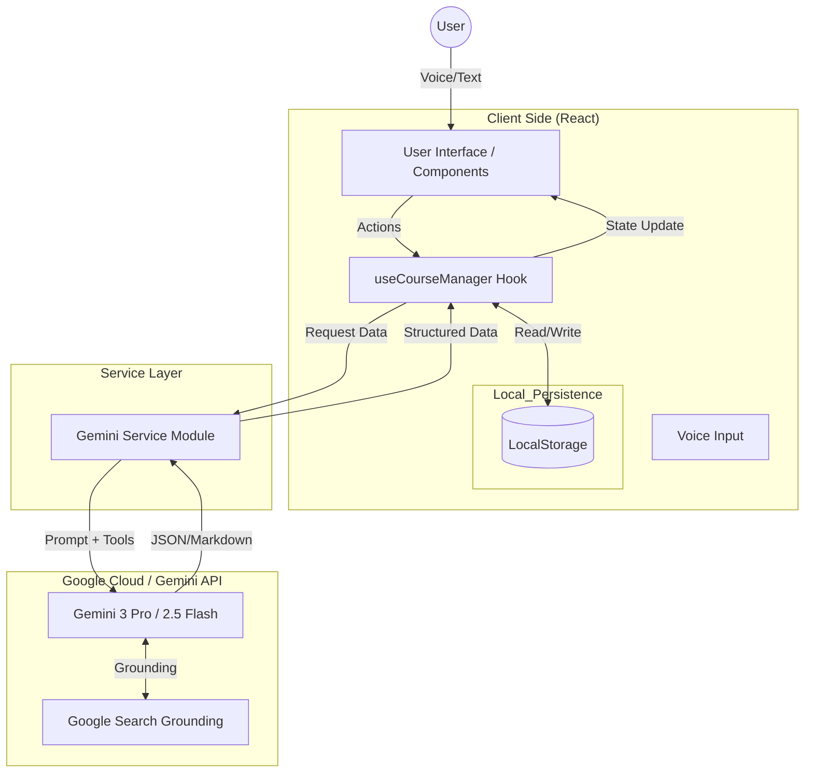

# Bangla EduAgent

Bangla EduAgent is a Multi-Agent AI system designed to democratize education for Bengali speakers. By leveraging Google's Gemini 3 Pro model, it creates personalized learning paths, extracting data from high-quality sources like Kaggle and Google, and presenting it in an accessible, localized format with interactive quizzes.

## Features

-   **Multi-Agent Orchestration**:
    -   **Researcher Agent**: Scrapes and grounds data using Google Search.
    -   **Translator Agent**: Converts technical content into natural Bengali.
    -   **Examiner Agent**: Generates context-aware quizzes.
-   **Personalized Syllabus**: Generates structured modules based on user topics.
-   **Interactive Dashboard**: Tracks progress with visual charts.
-   **Voice Input**: Supports Bengali/English voice search.
-   **Persistence**: Auto-saves course progress to local storage.
-   **Export**: Download courses as Markdown files for offline study.

## Architecture

The application follows a Clean Architecture approach adapted for a React functional component structure.

### High-Level Diagram



### Component Breakdown

1.  **Orchestrator (`useCourseManager`)**: Central brain. Manages state transitions (Idle -> Researching -> Translating), handles persistence, and coordinates data flow.
2.  **Service Layer (`geminiService.ts`)**: Handles direct API calls.
    -   `generateCourseSyllabus`: Uses `googleSearch` tool for grounding.
    -   `generateModuleContent`: Uses Gemini 3 Pro for high-fidelity translation/generation.
    -   `generateQuiz`: Uses JSON Schema enforcement for structured quiz output.
3.  **UI Layer**:
    -   `CourseDashboard`: Visualizes progress and modules.
    -   `ModuleViewer`: Renders Markdown content.
    -   `AgentTerminal`: Visualizes the "thinking" process of the AI agents.

## Local Development Guide

Follow these steps to run the Bangla EduAgent on your local machine.

### Prerequisites

*   **Node.js**: Version 18 or higher.
*   **Google Gemini API Key**: Get one from [Google AI Studio](https://aistudio.google.com/).

### Installation Steps

1.  **Clone the Repository**
    ```bash
    git clone https://github.com/your-username/bangla-edu-agent.git
    cd bangla-edu-agent
    ```

2.  **Install Dependencies**
    ```bash
    npm install
    # or
    yarn install
    ```

3.  **Configure Environment Variables**
    Create a `.env` file in the root directory of the project. Add your Gemini API key:
    ```env
    # .env
    API_KEY=your_actual_api_key_here
    ```
    *Note: If you are using Vite, you might need to prefix variables (e.g., `VITE_API_KEY`) and update the code references accordingly, or use a specific plugin for environment variables.*

4.  **Run the Development Server**
    ```bash
    npm start
    # or depending on your build tool (e.g., Vite)
    npm run dev
    ```

5.  **Access the App**
    Open your browser and navigate to `http://localhost:3000` (or the port shown in your terminal).

## Technologies

-   **Frontend**: React 19, Tailwind CSS, Lucide React
-   **AI**: Google GenAI SDK (`@google/genai`)
-   **Models**: `gemini-3-pro-preview`, `gemini-2.5-flash`
-   **Charts**: Recharts
-   **Markdown**: React Markdown
